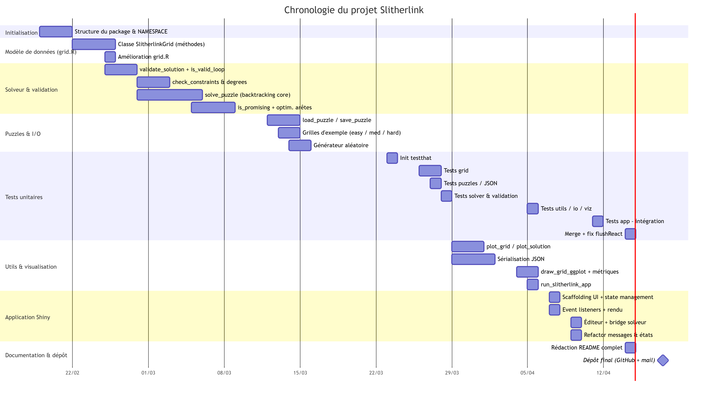

# 🧩 Slitherlink - Puzzle Solver & Interactive Game

<div align="center">


**Un package R complet avec solveur automatique et interface interactive**

[Installation](#-installation) • [Utilisation](#-utilisation-rapide) • [Documentation](#-documentation) • [Application Shiny](#-application-shiny)

</div>

---

## 📋 Table des matières

- [À propos](#-à-propos)
- [Fonctionnalités](#-fonctionnalités)
- [Technologies](#-technologies-utilisées)
- [Installation](#-installation)
- [Utilisation rapide](#-utilisation-rapide)
- [Architecture](#-architecture-du-projet)
- [Algorithme](#-algorithme-de-résolution)
- [Application Shiny](#-application-shiny)
- [Tests](#-tests)
- [Documentation](#-documentation)
- [Diagramme de Gantt](#-diagramme-de-gantt--planning-du-projet)
- [Auteurs](#-auteurs)
- [Licence](#-licence)

---

## 📖 À propos

**Slitherlink** est un jeu de puzzle logique japonais où l'objectif est de tracer une **seule boucle fermée** en respectant des contraintes numériques.

Ce projet a été développé dans le cadre du cours de **Programmation avec R** à l'**Université de Montpellier** (2026).

### 🎮 Règles du jeu

1. **Tracez une boucle unique** : Une seule ligne continue qui forme une boucle fermée
2. **Respectez les contraintes** : Les chiffres (0, 1, 2, 3) indiquent combien de côtés de la case font partie de la boucle
3. **Pas de croisement** : La boucle ne doit jamais se croiser ni se toucher elle-même
4. **Degré des points** : Chaque point de la grille a exactement 0 ou 2 arêtes

**Exemple :**
```
Puzzle :                  Solution :
  +---+---+---+             •───•───•───•
  | 2 |   | 2 |             │ 2       2 │
  +---+---+---+             •   •   •   •
  |   |   |   |             │           │
  +---+---+---+             •───•   •───•
  | 2 |   | 2 |               2 │   │ 2  
  +---+---+---+             •   •───•   •
```

---

## ✨ Fonctionnalités

### 🔧 Package R complet

- ✅ **Création de grilles** personnalisées ou pré-définies (facile, moyen, difficile)
- ✅ **Solveur automatique** avec algorithme de backtracking optimisé
- ✅ **Validation de solutions** selon toutes les règles du jeu
- ✅ **Import/Export JSON** pour sauvegarder et charger des puzzles
- ✅ **Génération aléatoire** de puzzles paramétrables
- ✅ **Visualisation graphique** avec ggplot2
- ✅ **Statistiques** détaillées sur les grilles

### 🎨 Application Shiny interactive

- 🎮 Interface utilisateur intuitive avec onglets (Prédéfinis / Personnalisé)
- 🤖 Résolution automatique en un clic (jusqu'à 10 millions d'itérations)
- ✅ Vérification de solution en temps réel avec messages détaillés
- 📊 Statistiques affichées dynamiquement
- 🎨 Visualisation graphique interactive (ggplot2)
- 🔄 Gestion de puzzles : Facile (2×2) / Moyen (3×3) / Difficile (5×5)
- ✏️ Éditeur de grille personnalisée : ajout/suppression de contraintes à la volée

### 🧪 Qualité & Tests

- ✅ Suite de tests unitaires avec `testthat`
- ✅ Documentation générée avec `roxygen2`
- ✅ Code structuré selon les standards R (R6, OOP)
- ✅ Gestion de versions avec Git

---

## 🛠 Technologies utilisées

<div align="center">

| Technologie | Version | Usage |
|------------|---------|-------|
|  | 4.3+ | Langage principal |
|  | 2.5.0+ | Programmation orientée objet |
|  | 1.7.0+ | Interface web interactive |
|  | 3.0.0+ | Visualisation graphique |
|  | 3.0.0+ | Tests unitaires |
|  | 1.8.0+ | Import/Export JSON |
|  | 7.3.3+ | Documentation |

</div>

---

## 📦 Installation

### Prérequis

- **R** version 4.3 ou supérieure
- **RStudio** (recommandé)

### Installation des dépendances
```r
install.packages(c("R6", "shiny", "jsonlite", "ggplot2", "testthat", "roxygen2", "devtools"))
```

### Cloner le projet
```bash
git clone https://github.com/ousmane-soumah01/Slitherlink.git
cd Slitherlink
```

### Charger le package
```r
# Option 1 : Charger les fichiers source directement
source("R/grid.R")
source("R/validation.R")
source("R/solver.R")
source("R/puzzles.R")
source("R/utils.R")

# Option 2 : Installer le package localement (recommandé)
devtools::load_all()
```

---

## 🚀 Utilisation rapide

### Exemple 1 : Créer et résoudre un puzzle simple
```r
library(Slitherlink)

# Créer une grille 3×3
grid <- create_grid(3, 3)

# Ajouter des contraintes
grid$add_constraint(1, 1, 2)
grid$add_constraint(1, 3, 2)
grid$add_constraint(3, 1, 2)
grid$add_constraint(3, 3, 2)

# Afficher la grille (mode texte)
plot_grid(grid)

# Résoudre automatiquement
solution <- solve_puzzle(grid)

# Vérifier la solution
validate_solution(solution)  # TRUE

# Visualiser la solution
draw_grid_ggplot(solution)
```

### Exemple 2 : Utiliser les puzzles pré-définis
```r
# Puzzle facile (2×2)
grid_easy <- create_example_easy()
solution <- solve_puzzle(grid_easy)

# Puzzle moyen (3×3)
grid_medium <- create_example_medium()

# Puzzle difficile (5×5 avec bloc central de zéros)
grid_hard <- create_example_hard()
```

### Exemple 3 : Générer un puzzle aléatoire
```r
# Générer une grille 7×7 avec 30% de contraintes
random_grid <- generate_random_puzzle(width = 7, height = 7, density = 0.3)
plot_grid(random_grid)
```

### Exemple 4 : Sauvegarder et charger un puzzle
```r
# Sauvegarder dans un fichier JSON
save_puzzle(grid, "mon_puzzle.json")

# Charger depuis un fichier JSON
loaded_grid <- load_puzzle("mon_puzzle.json")
```

### Exemple 5 : Pipeline complet
```r
# 1. Créer
grid <- create_grid(5, 5)
grid$add_constraint(2, 2, 3)
grid$add_constraint(2, 4, 2)
grid$add_constraint(4, 2, 2)
grid$add_constraint(4, 4, 3)

# 2. Statistiques
print_statistics(grid)

# 3. Résoudre
solution <- solve_puzzle(grid)

# 4. Vérifier et visualiser
if (validate_solution(solution)) {
  cat("✅ Solution valide !\n")
  draw_grid_ggplot(solution)
}
```

### Exemple 6 : Lancer l'application Shiny
```r
run_slitherlink_app()
```

---

## 🏗 Architecture du projet

```
Slitherlink/
├── R/                          # Code source du package
│   ├── grid.R                  # Classe R6 SlitherlinkGrid
│   ├── validation.R            # Validation des solutions
│   ├── solver.R                # Algorithme de résolution (backtracking)
│   ├── puzzles.R               # Gestion des puzzles (load/save/generate)
│   └── utils.R                 # Fonctions utilitaires (plot, stats, JSON)
│
├── inst/                       # Fichiers installés avec le package
│   ├── shiny/                  # Application Shiny
│   │   └── app.R               # Interface utilisateur et logique serveur
│   └── puzzles/                # Puzzles JSON pré-définis
│
├── tests/                      # Tests unitaires
│   ├── testthat.R              # Point d'entrée testthat
│   └── testthat/               # Fichiers de tests
│       ├── test-grid.R         # Tests de la classe grille (5 tests)
│       ├── test-solver.R       # Tests du solveur (3 tests)
│       ├── test-validation.R   # Tests de validation (3 tests)
│       ├── test-puzzles.R      # Tests de gestion des puzzles (3 tests)
│       ├── test-utils.R        # Tests des utilitaires (3 tests)
│       └── test-app.R          # Tests de l'application Shiny (19 tests)
│                                 # Hydratation Shiny, event dispatcher,
│                                 # éditeur et bridge solveur
│
├── docs/                       # Ressources de documentation
│   └── gantt_slitherlink.png   # Diagramme de Gantt du projet
│
├── man/                        # Documentation générée par roxygen2
├── vignettes/                  # Vignettes du package (répertoire prévu)
├── DESCRIPTION                 # Métadonnées du package (v1.0.0)
├── NAMESPACE                   # Fonctions exportées (19 exports)
└── README.md                   # Documentation principale du projet
```
---

## 🧠 Algorithme de résolution

Le solveur implémente un **algorithme de backtracking** avec plusieurs optimisations ciblées.

### 1️⃣ Exclusion des arêtes impossibles

Avant la recherche, `get_all_possible_edges()` exclut toutes les arêtes adjacentes à une case contrainte à **0**. Cela réduit significativement l'espace de recherche dès le départ.

### 2️⃣ Parcours géographique ordonné

Les arêtes sont explorées dans l'ordre géographique (case par case, de gauche à droite, de haut en bas). Cet ordre permet de déclencher l'élagage très tôt dans la recherche.

### 3️⃣ Backtracking avec élagage précoce (`is_promising`)

```
Pour chaque arête possible :
  ├─ BRANCHE 1 : Ajouter l'arête
  │   ├─ is_promising() ?
  │   │   ├─ OUI → Continuer récursivement
  │   │   └─ NON → Abandonner (élagage)
  │   └─ Backtrack : retirer l'arête
  └─ BRANCHE 2 : Ne pas ajouter l'arête
      └─ Continuer récursivement
```

### 4️⃣ Critères d'élagage (`is_promising`)

Une branche est abandonnée immédiatement si :

- **Degré des points** : un point possède déjà plus de 2 arêtes (`check_vertex_degrees`)
- **Contraintes dépassées** : le nombre d'arêtes autour d'une case dépasse sa contrainte

### 5️⃣ Validation finale (`validate_solution`)

Une solution complète est acceptée uniquement si :

- La boucle est **fermée** (chaque point utilisé a exactement degré 2)
- La boucle est **unique et connexe** (détection par parcours DFS)
- Toutes les **contraintes numériques** sont exactement satisfaites

### 📊 Complexité et performances

- **Pire cas théorique** : O(2ⁿ) où n = nombre d'arêtes possibles
- **Cas pratique** : fortement réduit grâce à l'élagage précoce et à l'exclusion des arêtes liées aux zéros
- **Limite configurable** : `max_iterations` (défaut : 10 000 000)
- **Timeout** : signalé proprement via `options(slitherlink_timeout)` sans crasher l'application

---

## 🎨 Application Shiny

L'application web interactive (`inst/shiny/app.R`) offre une expérience complète :

### Interface

- **Panneau latéral** : deux onglets — *Prédéfinis* (puzzles fournis) et *Personnalisé* (éditeur de grille)
- **Zone principale** : visualisation ggplot2 et affichage texte en temps réel
- **Messages dynamiques** : feedback coloré (succès / erreur / avertissement / info)

### Contrôles disponibles

| Bouton | Fonction | Description |
|--------|----------|-------------|
| 🎲 Charger la Partie | `new_game` | Charge un puzzle pré-défini |
| Créer la grille | `create_custom` | Instancie une grille vide personnalisée |
| ➕ Ajouter | `add_custom_c` | Ajoute une contrainte à la position choisie |
| ➖ Retirer | `remove_custom_c` | Retire une contrainte |
| 🧹 Effacer TOUTES | `clear_all_custom_c` | Remet la grille à zéro |
| 🗑️ Effacer les lignes | `clear_solution` | Efface les arêtes tracées |
| ✅ Vérifier | `check_solution` | Vérifie si la solution est correcte |
| 🤖 Résoudre Auto | `solve` | Lance le solveur backtracking |

### Visualisation ggplot2

- 🔵 Points gris aux intersections
- 🔵 Chiffres bleus en gras (contraintes)
- 🔴 Segments rouges épais (solution tracée)
- ⬜ Grille grise claire en arrière-plan

### Gestion des états du solveur

| État | Signification |
|------|--------------|
| `solved` | Solution trouvée et validée |
| `timeout` | Limite d'itérations atteinte, résultat inconnu |
| `impossible` | Espace de recherche épuisé, aucune solution n'existe |

---

## 🧪 Tests

Le projet inclut une suite de tests unitaires avec `testthat` :

```r
# Exécuter tous les tests
library(testthat)
test_dir("tests/testthat")
```

### Couverture des tests

| Fichier | Tests | Contenu |
|---------|-------|---------|
| `test-grid.R`       | 14 | Création de grille, contraintes, arêtes, comptage, suppression |
| `test-solver.R`     |  8 | Convergence, détection d'impossibilité, deep clone |
| `test-validation.R` |  5 | Cycle fermé, degrés des sommets, satisfaction des contraintes |
| `test-puzzles.R`    | 14 | Load/save JSON, grilles d'exemple, générateur aléatoire |
| `test-utils.R`      | 14 | Rendu stdout, métriques heuristiques, sérialisation JSON |
| `test-app.R`        | 19 | Hydratation Shiny, event dispatcher, éditeur, bridge solveur |

### Points clés testés

- ✅ Création et manipulation de grilles (`SlitherlinkGrid`)
- ✅ Ajout, suppression et détection d'arêtes
- ✅ Comptage d'arêtes autour d'une case
- ✅ Validation topologique (boucle fermée unique)
- ✅ Contrôle des degrés des sommets (max 2)
- ✅ Satisfaction des contraintes numériques
- ✅ Convergence du solveur sur une configuration valide
- ✅ Sortie gracieuse (`NULL`) sur une configuration impossible
- ✅ Isolation mémoire via deep clone R6

---

## 📚 Documentation

La documentation est générée avec `roxygen2` et disponible dans le répertoire `man/` :

```r
# Accéder à la documentation d'une fonction
?create_grid
?solve_puzzle
?validate_solution
?run_slitherlink_app

# Voir toutes les fonctions exportées
help(package = "Slitherlink")
```

### Référence des fonctions exportées

| Catégorie | Fonction | Description |
|-----------|----------|-------------|
| **Classe** | `SlitherlinkGrid` | Classe R6 représentant la grille |
| **Création** | `create_grid(width, height)` | Crée une grille vide |
| | `create_example_easy()` | Puzzle facile 2×2 |
| | `create_example_medium()` | Puzzle moyen 3×3 |
| | `create_example_hard()` | Puzzle difficile 5×5 |
| | `generate_random_puzzle(w, h, density)` | Génère un puzzle aléatoire |
| **Manipulation** | `add_constraint(grid, row, col, value)` | Ajoute une contrainte |
| | `save_puzzle(grid, filename)` | Sauvegarde un puzzle en JSON |
| | `load_puzzle(filename)` | Charge un puzzle depuis JSON |
| | `grid_to_json(grid)` | Convertit une grille en JSON |
| | `json_to_grid(json_str)` | Reconstruit une grille depuis JSON |
| **Validation** | `validate_solution(grid)` | Vérifie la solution complète |
| | `is_valid_loop(grid)` | Vérifie la topologie de la boucle |
| | `check_constraints(grid)` | Vérifie les contraintes numériques |
| | `check_vertex_degrees(grid)` | Vérifie les degrés des points |
| **Résolution** | `solve_puzzle(grid, max_iterations)` | Résout un puzzle automatiquement |
| **Visualisation** | `plot_grid(grid)` | Affichage texte dans la console |
| | `plot_solution(grid)` | Affichage texte de la solution |
| | `draw_grid_ggplot(grid)` | Visualisation graphique ggplot2 |
| **Statistiques** | `grid_statistics(grid)` | Retourne les métriques de la grille |
| | `print_statistics(grid)` | Affiche les métriques dans la console |
| **Application** | `run_slitherlink_app()` | Lance l'application Shiny |

---

## 👨‍💻 Auteurs

**Ousmane SOUMAH** *(auteur & mainteneur)*
📧 ousmaneozosoumah924@gmail.com

**Rodrigue MAMY** *(auteur & contributeur)*
📧 mamyrodriguez7@gmail.com

👨‍🏫 **Relecteur** : Jean-Michel Marin — jean-michel.marin@umontpellier.fr
🎓 Université de Montpellier
📅 Version 1.0.0 — Avril 2026

---

## 📅 Chronologie du projet

Le projet s'est développé sur **8 semaines** (19 février → 17 avril 2026), en deux branches de contribution parallèles.

| Phase | Période | Contributeur principal |
|-------|---------|----------------------|
| Initialisation du package | 19 fév | Ousmane |
| Modèle de données (`grid.R`) | 22–25 fév | Rodrigue → Ousmane |
| Solveur & validation | 25 fév – 8 mar | Ousmane |
| Puzzles & I/O JSON | 12–14 mar | Rodrigue |
| Utils & visualisation ggplot2 | 29 mar – 5 avr | Ousmane |
| Tests unitaires | 23 mar – 14 avr | Rodrigue puis Ousmane |
| Application Shiny | 7–9 avr | Ousmane |
| Documentation & dépôt | 14–17 avr | Ousmane |

> **14 avril 2026** — Commit du README final et correction des tests d'intégration Shiny (`session$flushReact`). `[ FAIL 0 | WARN 0 | SKIP 0 | PASS 74 ]`

> **17 avril 2026 avant 17h** — Dépôt final sur GitHub et envoi par mail à jean-michel.marin@umontpellier.fr

> Rodrigue a posé les fondations du modèle objet et de la suite de tests ; Ousmane a développé le solveur, les utilitaires, les corrections de bugs et l'intégralité de l'interface Shiny.

---

## 📅 Diagramme de Gantt – planning du projet



***Figure — Planning du projet Slitherlink.***

---

## 🙏 Remerciements

- **Jean-Michel Marin** — Professeur encadrant et relecteur
- **Université de Montpellier** — Cadre académique
- **Communauté R** — Packages et documentation

---

## 📚 Références

- [Slitherlink sur Wikipedia](https://en.wikipedia.org/wiki/Slitherlink)
- [Backtracking Algorithms](https://en.wikipedia.org/wiki/Backtracking)
- [Constraint Satisfaction Problems (CSP)](https://en.wikipedia.org/wiki/Constraint_satisfaction_problem)
- [R6 Classes](https://r6.r-lib.org/)
- [Shiny Documentation](https://shiny.rstudio.com/)
- [ggplot2 Documentation](https://ggplot2.tidyverse.org/)

---

## 📄 Licence

Ce projet est distribué sous licence **MIT**. Voir le fichier `LICENSE` pour plus de détails.

---

<div align="center">

**⭐ Si ce projet vous a plu, n'hésitez pas à lui donner une étoile sur GitHub ! ⭐**

Made with ❤️ and 

</div>
